# 如何设计一个分布式缓存系统？

## 一、缓存概述

对于**缓存**，相信大家已经十分熟悉了，在日常开发中，我们经常会使用到缓存。但对于缓存，这个看似简单的东西，你真的了解它吗？

### 1.1 什么是缓存？

缓存是一种用于存储`临时数据`的`高速`数据存储层，通过将频繁访问的数据存储在内存中，来`提高数据访问性能`。在计算机系统中，缓存无处不在，从
CPU 的多级缓存，到操作系统的`页缓存`，到浏览器的页面缓存，再到分布式系统中的数据缓存，都在发挥着重要作用。

### 1.2 为什么需要缓存？

- **提升性能**：通过将热点数据存储在内存中，避免频繁访问数据库或磁盘，显著提高数据访问速度。
- **减轻数据库压力**：降低数据库的访问负载，提高系统的并发处理能力。
- **提高系统可用性**：当数据库出现故障时，缓存可以作为临时的数据源，保证系统的基本可用性

根本原因还是 `CPU、内存、磁盘的读取速度差异巨大`:

- CPU L1 缓存: ~1ns
- 内存: ~100ns
- SSD: ~0.1ms
- HDD: ~10ms

### 1.3 适合使用缓存的场景

既然缓存能够提升系统性能，那么我们是否就可以无脑地使用缓存呢？肯定不是的。

以下这些场景才适合使用缓存：

- **读多写少的数据**：如商品信息、用户信息等相对稳定的数据。
- **计算复杂的数据**：如统计数据、排行榜等需要大量计算的数据。
- **高并发访问的数据**：如热点新闻、热门商品等。
- **基础数据**：如字典数据、配置信息等变更频率低的数据。

对于数据实时性要求不高的场景可以使用缓存，但如果要求实时性很高，建议直接使用数据库。因为现代数据库性能已经足够强大，而引入缓存会增加系统复杂度和维护成本。

### 1.4 Java中的缓存方案

1.**本地缓存**

- Map/ConcurrentHashMap：最简单的缓存实现，适合小规模数据。
- Guava Cache：Google 开源的本地缓存实现
- EhCache：老牌的 Java 缓存框架
- Caffeine：高性能的本地缓存库

2.**分布式缓存**

- Redis：最流行的分布式缓存系统
- Memcached：高性能的分布式内存缓存系统

## 二、Caffeine 原理解析

`Caffeine` 是目前 Java 中性能最好的本地缓存方案，它在 `Guava Cache` 的基础上做了大量优化。

### 2.1 Caffeine 的设计思想

`Caffeine` 的设计目标是在保证`高并发读写` 性能的同时，能够最大限度地利用`内存空间` 。为了达到这个目标，`Caffeine`
在以下几个方面都做了精心的设计：

1. **缓存淘汰算法的创新**

    - 传统的 **LRU**（最近最少使用）算法无法很好地处理`扫描污染`问题。
    - 传统的 **LFU**（最不经常使用）算法对`突发性的热点数据`支持不好。
    - Caffeine 创新性地采用了 **Window TinyLFU** 算法，结合了 `LRU` 和 `LFU` 的优点。

2. **并发编程的精妙设计**

    - 采用了`分段锁技术`，降低锁粒度。
    - 使用`无锁编程`技术，减少线程竞争。
    - 优化的异步处理机制。

下面来详解下 `Caffeine`的`Window TinyLFU`算法。

### 2.2 Window TinyLFU 算法详解

`Window TinyLFU` 是 `Caffeine` 性能优化的关键所在，它主要包含以下几个部分：

2.2.1. **准入窗口（Admission Window）**

`准入窗口` 的本质是一个`小型的 LRU 缓存`，用于`过滤突发性的访问`，避免对主缓存造成`污染`。

   ```mermaid
   graph LR
       A[新数据] --> B[准入窗口<br>Window Cache<br>占比 1%]
       B --> C{频率统计}
       C -->|频率高| D[主缓存<br>Main Cache<br>占比 99%]
       C -->|频率低| E[丢弃]
       
       subgraph Window TinyLFU
           B
           C
           D
       end
   ```

**工作流程：**

   ```mermaid
   sequenceDiagram
       participant Client as 客户端
       participant Window as 准入窗口
       participant Sketch as 频率统计器
       participant Main as 主缓存
       
       Client->>Window: 1. 请求数据
       Window->>Sketch: 2. 统计访问频率
       Sketch->>Window: 3. 返回频率信息
       alt 频率高于阈值
           Window->>Main: 4a. 允许进入主缓存
       else 频率低于阈值
           Window->>Client: 4b. 直接返回，不进入主缓存
       end
   ```

2.2.2.**频率统计（Frequency Sketch）**

`Frequency Sketch` 使用`Count-Min Sketch` 数据结构来记录访问频率，这是一个`概率型`数据结构，用`较小的空间实现频率统计`。

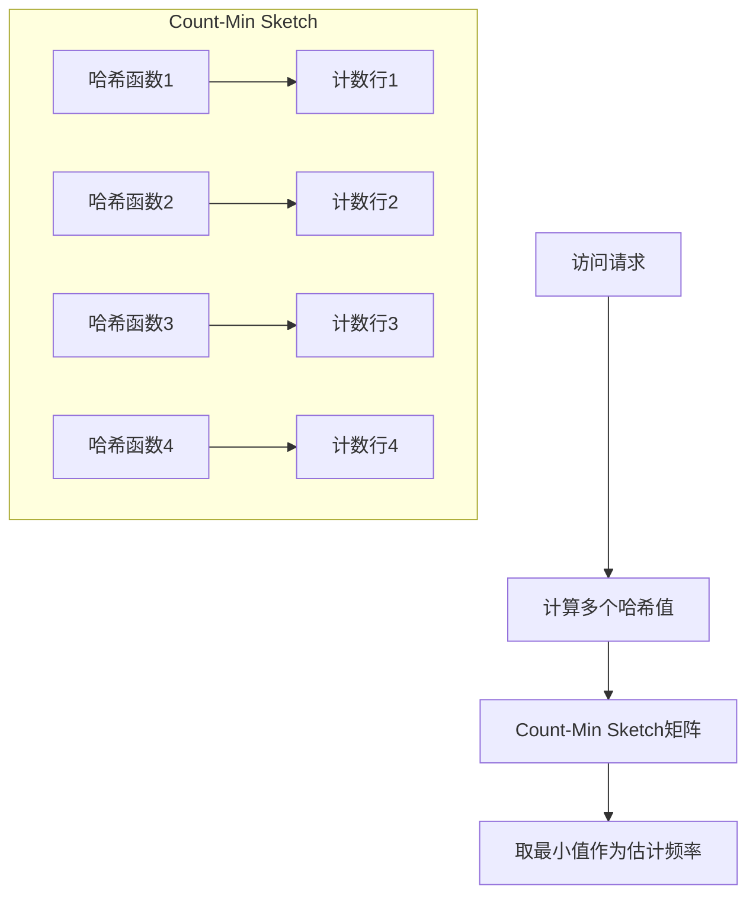

**Count-Min Sketch 的工作原理：**

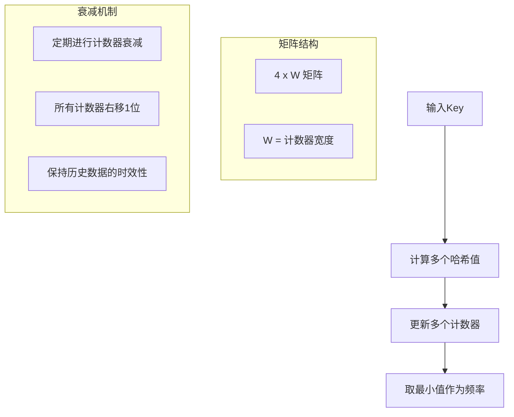

2.2.3. **优化的淘汰策略**

 ```mermaid
   graph TD
       A[缓存满] --> B{比较频率}
       B -->|新数据频率更高| C[替换最旧数据]
       B -->|新数据频率更低| D[拒绝新数据]
       
       subgraph 频率计算
       E[实时频率] --> F[历史频率]
       F --> G[衰减因子]
       end
```

示例实现代码：

```java
public class FrequencySketch {
    private final long[] table;
    private final int[] seeds;
    private final int width;
    private final int rows;

    public FrequencySketch(int width, int rows) {
        this.table = new long[width * rows];
        this.seeds = new int[rows];
        this.width = width;
        this.rows = rows;
        // 初始化随机种子
        Random random = new Random(1234);
        for (int i = 0; i < rows; i++) {
            seeds[i] = random.nextInt();
        }
    }

    public void increment(long item) {
        // 更新所有行的计数器
        for (int i = 0; i < rows; i++) {
            int index = indexOf(item, i);
            if (table[index] < Long.MAX_VALUE) {
                table[index]++;
            }
        }
    }

    public long frequency(long item) {
        // 获取最小计数值作为估计频率
        long min = Long.MAX_VALUE;
        for (int i = 0; i < rows; i++) {
            min = Math.min(min, table[indexOf(item, i)]);
        }
        return min;
    }

    private int indexOf(long item, int row) {
        // 使用不同的哈希函数计算索引
        long hash = item * seeds[row];
        hash += hash >>> 32;
        return ((int) hash & Integer.MAX_VALUE) % width + (row * width);
    }
}
```

### 2.3 高并发设计

`Caffeine` 在`并发处理`上也做了大量优化。

2.3.1. **分段锁设计**

```java
// 简化的分段锁示意
class StripedBuffer<K, V> {
    private final Object[] locks;
    private final Buffer<K, V>[] buffers;

    public void write(K key, V value) {
        int index = hash(key) % locks.length;
        synchronized (locks[index]) {
            buffers[index].put(key, value);
        }
    }
}
```

- 降低锁粒度，提高并发性
- 减少线程等待时间
- 优化写入性能

2.3.2.**异步处理机制**

```java
// Caffeine 异步加载示例
LoadingCache<Key, Graph> graphs = Caffeine.newBuilder()
                .maximumSize(10_000)
                // 设置缓存过期时间  
                .expireAfterWrite(Duration.ofMinutes(5))
                // 设置缓存刷新时间  
                .refreshAfterWrite(Duration.ofMinutes(1))
                .build(key -> createExpensiveGraph(key));
   ```

- 支持异步加载和刷新
- 非阻塞的缓存操作
- 提高系统吞吐量

2.3.3.**写入缓冲区优化**

- 使用 `BufferWriter` 减少锁竞争
- 批量处理写入请求
- 提高写入效率

## 三、缓存面临的问题

虽说缓存能够提升系统性能，但与此同时，使用缓存也同样会带来很多问题。

### 3.1 缓存三大问题

下面是缓存的几个经典问题，面试中也经常会被问到，也确实是我们在使用缓存时需要思考和解决的问题。

1. **缓存击穿**

    - 问题：热点 key 过期导致大量请求直击数据库
    - 解决：使用分布式锁 + 二级缓存

2. **缓存雪崩**

    - 问题：大量缓存同时过期
    - 解决：过期时间随机化、多级缓存、熔断降级

3. **缓存穿透**

    - 问题：查询不存在的数据导致请求直击数据库
    - 解决：布隆过滤器、空值缓存

发现没有，上述问题，其实都可以尝试在数据库和本地缓存之间加一层中间层来解决。这也是软件架构设计中的一个常见模式 -
通过分层来化解复杂性。如果一层中间层解决不了，那就再加一层。🐶

### 3.2 **缓存一致性问题**

其实，个人觉得使用缓存面临的最核心的问题，其实是 `缓存一致性问题`。
这里的一致性，指的是缓存和数据库间的数据一致性，以及多个实例之间本地缓存的一致性。

有哪些场景可能会导致缓存一致性问题？

**常见的一致性问题**

- 更新数据库后缓存未及时更新。
- 并发更新导致的数据不一致。
- 分布式环境下的数据同步问题，例如多实例的本地缓存不一致。

**解决方案**

- 先更新数据库，再删除缓存
- 延时双删
- 消息队列实现最终一致性
- 分布式锁保证并发安全
- 版本号机制

## 四、分布式缓存架构设计

接下来我们来探讨在一个`分布式系统`中，应该如何来设计我们的缓存系统，以及如何解决上面提到的各种问题。

### 4.1 多级缓存架构

```
应用层
  ↓
本地缓存（Caffeine）
  ↓
分布式缓存（Redis）
  ↓
数据库
```

这里为什么引入 `Redis` 作为分布式缓存中间层呢？稍后会详细介绍。

### 4.2 缓存更新策略

常见的缓存更新策略有：

- **Cache Aside Pattern**
    - 先更新数据库，再删除缓存
- **Read/Write Through Pattern**
    - 先更新缓存，再更新数据源
- **Write Behind Pattern**
    - 先更新缓存，异步更新数据源

这里我们选择的是 `Cache Aside Pattern-先更新数据库，再删除缓存`。为什么呢？

让我们通过一个具体的场景来分析下：

1.**为什么是删除而不是更新缓存？**

- 删除缓存的操作比更新缓存更简单，不容易出错。
- 删除缓存后，后续请求会重新加载数据，确保数据的正确性。
- 如果更新缓存，在并发情况下可能会出现数据不一致的问题。

2.**为什么是先更新数据库，再删除缓存？**

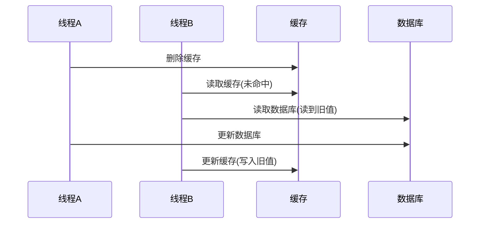

- 如果先删除缓存，再更新数据库，在高并发场景下会出现问题：
    1. 线程A删除缓存
    2. 线程B读取缓存未命中，读取旧数据
    3. 线程A更新数据库
    4. 线程B将旧数据写入缓存
- 最终缓存中是旧数据，造成数据不一致。

3.**Cache Aside Pattern 策略是否存在并发问题？**

- 理论上存在并发问题，如下图，但概率极小。
- 需要满足以下条件才会出现问题：
    1. 缓存刚好失效
    2. 线程A更新数据库，尚未提交事务，此时线程B读取旧数据。
    3. 线程A提交事务，删除缓存。
    4. 线程B更新缓存
- 实际上在高并发场景中，这个时间窗口也非常小，因为一般从`已经读取到数据`到`设置到缓存`这个间隙其实非常短，除非刚好
  `因GC导致STW` 了等极端情况。

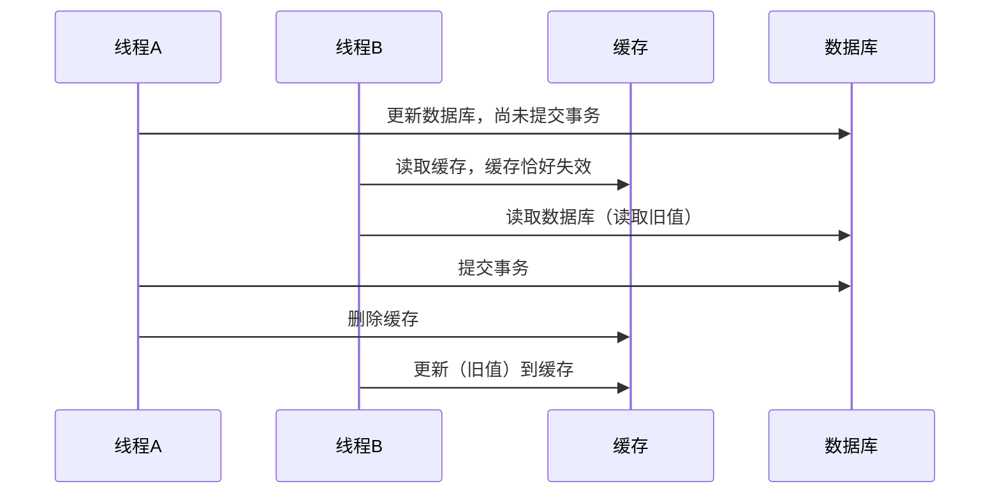

### 4.3 **如何解决极端情况下的并发问题？**

- **延迟双删**：在更新数据库后，延迟一段时间再次删除缓存，可以保障经过短暂时间后，缓存中的数据和数据库中的数据一致。

```java
    // 伪代码示例
void updateData() {
    // 1. 更新数据库
    db.update(data);
    // 2. 删除缓存
    cache.delete(key);
    // 3. 延迟一段时间后再次删除缓存
    Thread.sleep(500);
    cache.delete(key);
}
   ```

- **使用消息队列**：将缓存删除操作通过消息队列异步执行。

```java
// 伪代码示例
void updateData() {
    // 1. 更新数据库
    db.update(data);
    // 2. 发送消息到队列
    messageQueue.send(new CacheDeleteMessage(key));
}
   ```

### 4.4 **如何使用消息队列解决极端情况下的并发问题？**

> 延时双删能解决极端情况下的缓存一致性问题，可能很多同学都听说过，但为什么使用消息队列也可以？

1. 异步处理和解耦：

- 当数据库完成更新后（`事务提交后`），将`缓存删除` 操作作为一条消息发送到消息队列。
- 消息队列保证了删除操作的`顺序性`（需要使用顺序消费），即使存在多个请求对同一条数据进行操作，最终的缓存状态是一致的。

2. 去重和幂等性：

- 由于删除缓存的操作本身就是`幂等`的，所以即便消息队列重复消费，也不会对结果产生影响。

3. 重试机制：

- 如果由于某些异常，删除缓存的操作失败，消息队列可以提供`重试机制`，确保删除操作最终完成。

4. 并发场景的一致性：

- 即使在高并发场景下，多个线程同时操作同一条数据，通过消息队列的异步特性，可以确保数据库和缓存的状态最终一致。

#### **消息队列的实现**

- 每次数据库更新完成后发送消息到队列。
- 消息队列可以按照先后顺序处理缓存的删除操作，确保缓存最终的状态一致。

**流程图：**

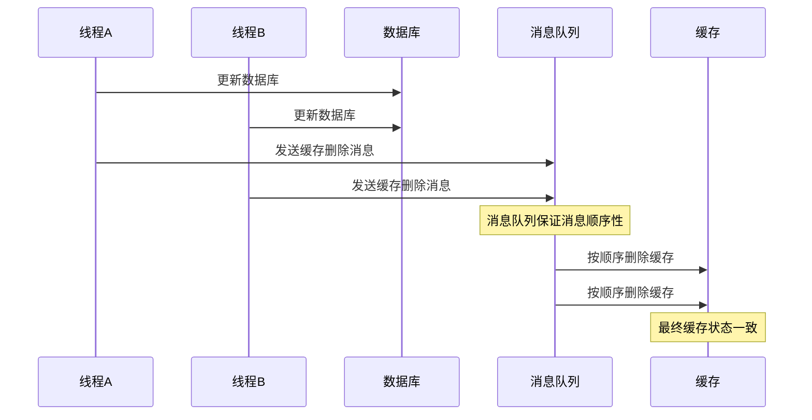

**消息队列的实现示例**

```java

@Service
public class CacheUpdateService {

    @Autowired
    private DatabaseService databaseService;
    @Autowired
    private MessageQueueService messageQueueService;

    public void updateDataAndNotifyCache(String key, Object value) {
        // 1. 更新数据库
        databaseService.update(key, value);
        // 2. 发送缓存删除消息 注意要在事务提交后发送
        // 这里使用 Spring 的事务管理器来确保在事务提交后发送消息
        TransactionSynchronizationManager.registerSynchronization(new TransactionSynchronization() {
            @Override
            public void afterCommit() {
                messageQueueService.sendMessage("cache_delete_topic", key);
            }
        });
    }
}
```

**消费者示例：**

```java

@Component
public class CacheDeleteConsumer {
    @Resource
    private CacheService cacheService;

    @KafkaListener(topics = "cache_delete_topic")
    public void onMessage(String key) {
        // 删除缓存，幂等操作
        cacheService.delete(key);
    }
}
```

## 五、One-Light-Cache 解决方案

在理解了上述分布式缓存的设计思路后，我们来看一个具体的实现方案：`One-Light-Cache`。

`One-Light-Cache` 是笔者写的一个`轻量级`的分布式缓存小组件，它整合了 `Caffeine` 和 `Redis` 的优势，并结合`消息队列`
实现了分布式环境下的`缓存一致性`。

完整代码可以参考 [One-Light-Cache](https://github.com/oneinstep/one-light-cache) 项目。

### 5.1 框架特性

1. **统一的缓存管理**

    - 集成本地缓存（Caffeine）和分布式缓存（Redis）
    - 统一的 API 接口
    - 集成 `Aviator` 表达式，支持复杂的缓存加载逻辑。
    - 集成 `Spring Boot` 配置，支持`配置化`管理缓存。

2. **分布式一致性保证**

    - 支持多种消息队列（Redis/RocketMQ/Kafka）通知缓存更新
    - `分布式锁`防止缓存击穿以及协调缓存一致性
    - 最终一致性保证

3. **缓存防护**

    - 内置防止缓存`击穿、雪崩、穿透`的机制

4. **监控统计**

    - 支持缓存命中率等一些`统计`

### 5.2 使用示例

#### 5.2.1. **基础配置**

```yaml
light:
  cache:
    # 缓存配置 可配置多个缓存
    cache-configs:
      # 测试用户缓存
      - cacheName: test-user-cache
        # 初始缓存数量
        initial-capacity: 20
        # 最大缓存数量
        maximum-size: 100
        # 5 秒后过期
        expire-after-write: 5000
        # 缓存加载表达式 使用 Aviator 表达式
        load-cache-expression: getUserById(key)
        # 加载缓存等待锁超时时间 超过该时间后，缓存加载失败，将设置null值
        load-cache-wait-lock-timeout: 3000
        # 获取数据超时时间
        fetch-data-timeout: 6000
        # mq 主题
        mq-topic: user_data_change
        # mq 类型，默认使用 RocketMQ
        mq-type: RocketMQ
    # 消费数据变更消息的消费者组
    consumer-group: cache-consumer-group
    # RocketMQ NameServer 地址，如果使用 RocketMQ 作为消息队列，则需要配置
    rocketmq-name-server: localhost:9876
    # Kafka 服务器地址，如果使用 Kafka 作为消息队列，则需要配置
    # kafka-bootstrap-servers: localhost:9092
```

#### 5.2.2. **代码示例**

```java
// 创建缓存
LightCacheManager .

<UserDTO> newCacheBuilder()
    .

cacheName("test-user-cache")
    .

initialCapacity(20)
    .

maximumSize(100)
    .

expireAfterWrite(5000)
// 可以通过 Function 函数或者 Aviator 表达式定义缓存加载方式
    .

fetcher(userId ->UserDTO.

builder().

userId(userId).

userName("user-"+userId).

build())
        // .loadCacheExpression("getUserById(userId)")
        .

loadCacheWaitLockTimeout(3000)
    .

fetchDataTimeout(6000)
    .

mqTopic("user_data_change")
    .

mqType(MQType.ROCKETMQ)
    .

buildAndRegister();

// 使用缓存
LightCache<UserDTO> cache = cacheManager.getCache("test-user-cache");
UserDTO user = cache.get("1");
```

### 5.3 原理和关键代码

#### 5.3.1 整体架构

- 分层设计
    - 采用三层缓存架构：应用层 -> 本地缓存(Caffeine) -> 分布式缓存(Redis)，通过多级缓存策略优化访问性能。
- 一致性保证
    - 使用消息队列（Redis/RocketMQ/Kafka）实现多节点间的缓存同步，保证分布式环境下的数据一致性。
- 数据流转
    - 读取路径：优先查本地缓存，未命中则查Redis，再未命中则通过分布式锁加载数据源。
    - 更新路径：更新数据后通过消息队列通知所有节点删除本地缓存，由抢到锁的节点负责更新Redis。
- 高可用设计
    - 通过分布式锁避免并发加载，消息队列保证可靠通知，多级缓存确保系统高可用。
      这种架构设计在保证数据一致性的同时，通过多级缓存和消息队列实现了高性能和高可用性，适合分布式环境下的缓存应用场景。

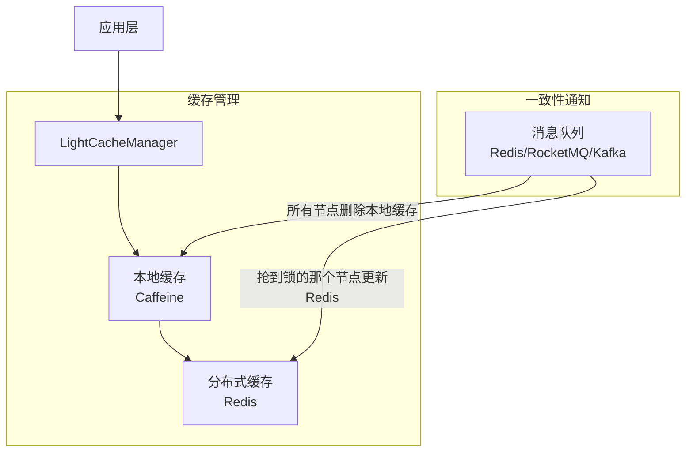

#### 5.3.2 数据读取流程

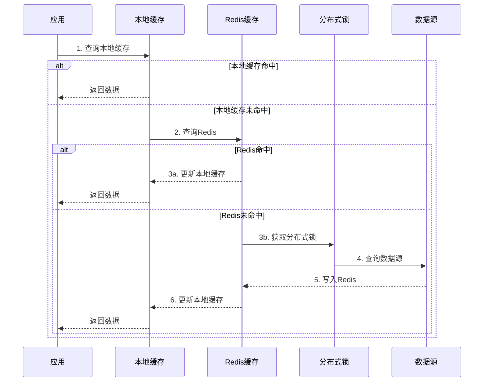

#### 5.3.3 关键实现

**核心类图：**

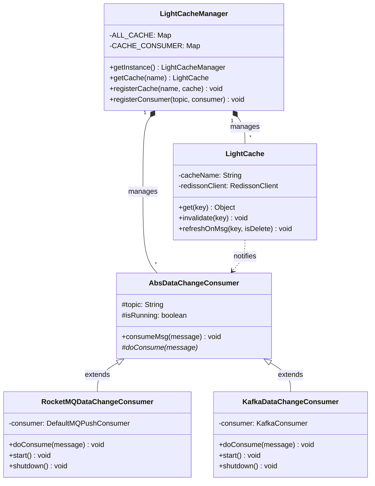

5.3.3.1.**缓存管理器**

采用单例模式管理全局缓存实例。

```java
public class LightCacheManager {
    // 缓存容器
    private static final Map<String, LightCache<?>> ALL_CACHE = new ConcurrentHashMap<>();

    // 缓存消费者
    private static final Map<String, AbsDataChangeConsumer> CACHE_CONSUMER = new ConcurrentHashMap<>();

    // 单例模式
    private static volatile LightCacheManager instance;

    public static LightCacheManager getInstance() {
        // ...
        return instance;
    }
}
```

5.3.3.2.**缓存构建器**

使用建造者模式提供流式API创建缓存，支持灵活配置缓存参数（如过期时间、容量等）和消息队列选项。

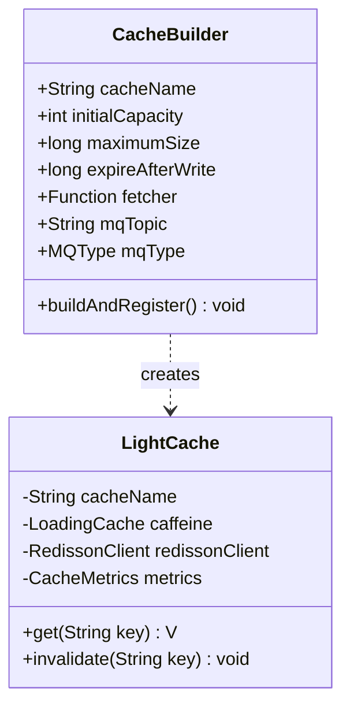

5.3.3.3.**缓存更新机制**

采用先更新数据库，再发送消息，最后删除缓存的更新策略，通过消息队列实现分布式环境下的缓存一致性。

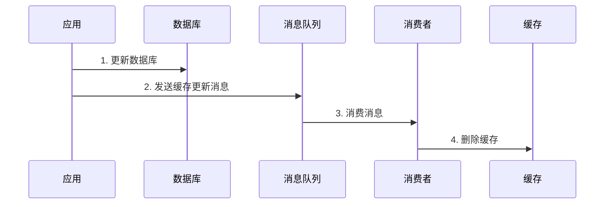

5.3.3.4.**消息消费者实现**

抽象消费者基类处理消息解析和缓存更新逻辑，支持 UPDATE 和 DELETE 等操作类型。

```java
public abstract class AbsDataChangeConsumer {
    protected final String topic;
    protected volatile boolean isRunning = true;

    public final void consumeMsg(String message) {
        if (!isRunning) {
            return;
        }

        DataChangeMsg dataChangeMsg = JSON.parseObject(message, DataChangeMsg.class);
        String dataName = dataChangeMsg.getDataName();
        String dataId = dataChangeMsg.getDataId();

        LightCache<?> cache = LightCacheManager.getInstance().getCache(dataName);

        switch (dataChangeMsg.getType()) {
            case UPDATE:
                cache.refreshOnMsg(dataId, false);
                break;
            case DELETE:
                cache.refreshOnMsg(dataId, true);
                break;
        }
    }
}
```

5.3.3.5.**缓存防护机制**

结合分布式锁和双重检查机制防止缓存击穿，通过等待超时和空值缓存防止缓存穿透。

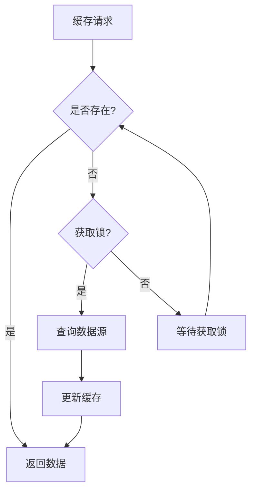

## 六、总结

### 6.1 One-Light-Cache 设计思路总结

1. **多级缓存架构**

    - 利用 Caffeine 作为本地缓存，提供高性能的本地数据访问
    - 使用 Redis 作为分布式缓存，解决分布式环境下的数据共享问题
    - 通过消息队列实现缓存一致性，保证多节点数据同步

2. **关键技术选型**

    - Caffeine：高性能的本地缓存实现
    - Redis：可靠的分布式缓存方案
    - 消息队列：支持多种选项（Redis/RocketMQ/Kafka），实现最终一致性

3. **核心特性**

    - 统一的缓存管理接口
    - 灵活的配置方式
    - 完善的缓存防护机制
    - 可靠的分布式一致性保证

### 6.2 缓存系统实践建议

1. **缓存策略选择**

    - 根据数据特性选择合适的缓存过期时间
    - 对于实时性要求高的数据，慎用缓存
    - 合理设置缓存容量，避免内存溢出

2. **一致性考虑**

    - 在绝大多数场景下，最终一致性已经足够
    - 对于强一致性要求的场景，建议直接查询数据源
    - 使用消息队列时注意消息的可靠性投递

3. **性能优化**

    - 合理使用预热机制，避免冷启动
    - 监控缓存命中率，及时调整缓存策略
    - 注意缓存穿透、击穿、雪崩的防护

缓存系统的设计和实现是一个复杂的工程，需要在性能、一致性、可用性等多个维度之间做出权衡。`One-Light-Cache`
只是提供了一个基础的解决方案，在实际使用中，还需要根据具体的业务场景做出适当的调整和优化。这里只希望这个项目能为大家提供一些参考和启发。

#### 推荐阅读

关于缓存相关开源框架和技术文章，大家可以看看：

- 京东的 [HotKey](https://gitee.com/jd-platform-opensource/hotkey.git)
    - 可以实现`热点数据`的毫秒级精准`探测`和自动本地缓存。
    - 主要原理：`Worker`机器与`Client`机器利用`Netty`建立网络连接，`Client`机器将数据`上报`给`Worker`机器，`Worker`机器进行数据
      `汇总`计算，然后将热点数据再`推送`到`Client`机器进行`本地缓存`。

- 有赞的透明多级缓存解决方案（TMC）
    - 目前没开源，但是可以参考其 [设计思路](https://tech.youzan.com/tmc/)。
    - 主要原理是对原生`jedis`包的`JedisPool`和`Jedis`类做了改造，在`JedisPool`初始化过程中集成`TMC`的`热点发现`+`本地缓存`
      功能。

- 携程的技术文章
    - [携程最终一致和强一致性缓存实践](https://mp.weixin.qq.com/s/E-chAZyHtaZOdA19mW59-Q)
    - [携程百亿级缓存系统探索之路——本地缓存结构选型与内存压缩](https://mp.weixin.qq.com/s/rMY_BP5bd-o9YkgXo1ySeg)

---

欢迎关注我的公众号“**子安聊代码**”，一起探讨技术。
<div style="text-align: center;">
    
</div>